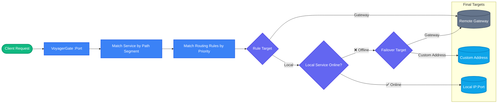

# <br>VoyagerGate

#### <br>Microservices local debugging gateway — bridging local and remote, automatic failover when offline.

[English](README.md) | [中文](README.zh-CN.md)

---

## The Problem

When debugging microservices, you only modify one or two services locally, yet you face:

| Approach | Pain Point |
|----------|------------|
| Run all services locally | Memory hog, tons of middleware, 30 min startup |
| Use test environment only | Your code changes don't take effect, no breakpoint debugging |
| Telepresence | K8s-only, heavy install, requires cluster permissions, CLI-only |
| Hand-written Nginx config | Reload on every change, prefix hell, no automatic failover |

**VoyagerGate solves this with a desktop app:** Pull services from the registry with one click, locally running services route to `127.0.0.1:port`, the rest go to the remote gateway, and offline services auto-failover — all through a visual UI, zero config files.

---

## Core Features

### 🖥️ Desktop GUI, Zero Config Files

Not a CLI tool, not a server deployment. Download, install, and you're ready. Registry address, gateway URL, service list, routing rules — configure everything with a few clicks, no YAML required.

### ⚡ Smart Routing, Effective on Pull

Pull all services from Nacos / Eureka / Consul with one click, and fallback routing rules are generated automatically. Locally running services route to `127.0.0.1:port`, the rest go to the remote gateway. Supports precise path matching, multi-rule priority, and automatic prefix stripping.

### 🔄 Automatic Failover, Uninterrupted Requests

Background TCP health checks (every 5 seconds by default). When a local service is online, traffic goes local; when it goes offline, traffic **automatically switches to the remote gateway** — no errors, no interruptions. Seamless traffic switching during local service restarts.

---

## How It Works



---

## Supported Registries

| Registry | Status | Description |
|----------|--------|-------------|
| Nacos | ✅ | Namespace and group support |
| Eureka | ✅ | Username/password authentication |
| Consul | ✅ | Datacenter and ACL Token support |
| Kubernetes | Planned | Coming soon |

---

## Feature Highlights

- **Multi-environment Switching** — dev / test / staging with independent configs, one-click switch, proxy hot-reload
- **Real-time Request Logs** — Every request's target (local / gateway), status code, and latency at a glance
- **Hot Config Reload** — Rule, service, and environment changes take effect without downtime
- **Import / Export** — Config export to YAML / JSON (passwords auto-masked), share debugging configs with your team
- **Loop Protection** — Rejects forwarding addresses pointing to the proxy's own port to prevent infinite loops
- **Dark / Light Theme** — Follows system preference

---

## Quick Start

### Download

Download the latest release from [GitHub Releases](https://github.com/cgy0214/voyagerGate/releases) or [Gitee](https://gitee.com/boy_0214/voyagerGate).

### Three Steps to Get Started

1. **Create Environment** — Fill in environment name, registry address, remote gateway URL, and proxy port
2. **Pull Services** — Click "Connect Registry" → "Pull Services", service list is imported automatically
3. **Start Proxy** — Click start, point your client requests to `http://127.0.0.1:<proxy-port>`

Locally running services automatically go local, the rest go to the remote gateway.

### Build from Source

```bash
# Requirements: Go 1.21+, Node.js 16+, Wails CLI
go install github.com/wailsapp/wails/v2/cmd/wails@latest

git clone https://github.com/cgy0214/voyagerGate.git
cd voyagerGate

wails dev      # Development mode (hot reload)
wails build    # Build production package
```

---

## Tech Stack

| Layer | Technology | Description |
|-------|-----------|-------------|
| Backend | Go | Native reverse proxy, read-write lock hot reload |
| Desktop | Wails v2 | Cross-platform desktop app, system tray |
| Frontend | Vue 3 + Vite | Dark / light theme |
| Config | YAML | Atomic write, import / export |

---

## Roadmap

- **Kubernetes Service Discovery** — Cover K8s scenarios
- **HTTP Proxy Forwarding** — Cover proxy forwarding scenarios
- **Request Recording & Replay** — Record requests with one click, reproduce bugs without asking frontend to click again
- **Built-in Mock Engine** — Mock downstream services that aren't ready yet, parallel frontend/backend development
- **Distributed Tracing Visualization** — See which services a request passes through and latency per service
- **macOS / Linux Official Builds** — Full cross-platform coverage

---

## Contributing

Issues and PRs are welcome! Project homepage: https://github.com/cgy0214/voyagerGate

Open source isn't easy — give it a ⭐ if you find it useful!

---

## Community

**QQ Group**: 498265967 ([Join](http://qm.qq.com/cgi-bin/qm/qr?_wv=1027&k=HHuK-ks_qF9KdaWI8UuIPzp22Qg3jSJ7&authKey=fBFgaomxUn3%2BfMgrRzHq9ZMyBZZ0eSAaU2JBO1oXe94RbnkUhlSI2SKjHjVK8Mij&noverify=0&group_code=498265967))


---

## License

[MIT](LICENSE)

Author: rabbit boy_0214@sina.com
