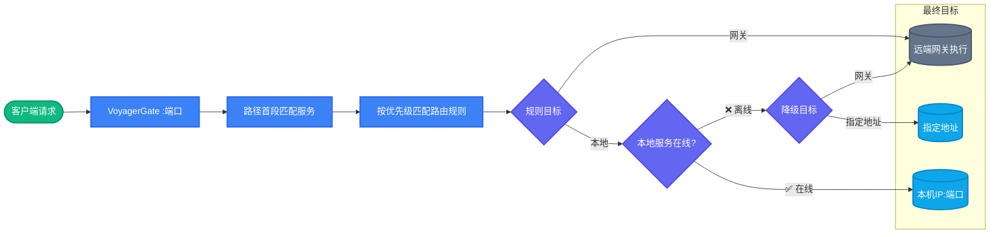

# <br>VoyagerGate 渡桥

#### <br>微服务本地联调网关 —— 本地与远端，一桥相连；本地离线，自动渡回。

[English](README.md) | [中文](README.zh-CN.md)

---

## 解决什么问题

微服务联调时，你本地只改了一两个服务，却要面对：

| 方案 | 痛点 |
|------|------|
| 本地起全部服务 | 内存爆炸、中间件装一堆、启动半小时 |
| 全走测试环境 | 改的代码不生效，没法断点调试 |
| Telepresence | 只支持 K8s、安装重、需要集群权限、命令行操作 |
| 手写 Nginx 配置 | 改一次 reload 一次，前缀绕来绕去，没有自动降级 |

**VoyagerGate 用一个桌面 App 解决：** 从注册中心一键拉取服务，本地启动的自动走本地，没启动的走远端网关，本地离线自动降级——全程可视化操作，零配置文件。

---

## 核心特点


### 🖥️ 桌面可视化，零配置文件

不是命令行工具，不是服务端部署。下载安装，打开即用。注册中心地址、网关地址、服务列表、路由规则——全部在界面上点几下搞定，不用写一行 YAML。

### ⚡ 智能分流，拉取即生效

从 Nacos / Eureka / Consul 一键拉取全部服务，自动生成兜底路由规则。本地起了的服务自动走 `127.0.0.1:端口`，没起的走远端网关。支持按路径精确匹配、多规则优先级、前缀自动剥离。

### 🔄 本地离线自动降级，请求不中断

后台 TCP 健康探测（默认 5 秒），本地服务在线走本地，离线**自动切回远端网关**，请求不报错、不中断。重启本地服务的间隙，流量无缝切换，联调体验丝滑。

---

## 工作原理



---

## 支持的注册中心

| 注册中心 | 状态 | 说明 |
|----------|------|------|
| Nacos | ✅ | 支持命名空间、分组 |
| Eureka | ✅ | 支持用户名密码认证 |
| Consul | ✅ | 支持数据中心、ACL Token |
| Kubernetes | 规划中 | 未来 |

---

## 功能一览

- **多环境秒切** —— dev / test / staging 每套独立配置，一键切换，代理热重启
- **实时请求日志** —— 每条请求的去向（本地 / 网关）、状态码、耗时一目了然
- **配置热更新** —— 规则、服务、环境变更无停机生效，改完即生效
- **导入导出** —— 配置导出 YAML / JSON，团队共享联调配置
- **死循环防护** —— 拒绝转发地址指向自身端口，避免回环访问
- **深色 / 浅色主题** —— 跟随系统，护眼模式

---

## 快速开始

### 下载

从 [GitHub Releases](https://github.com/cgy0214/voyagerGate/releases) 或 [Gitee](https://gitee.com/boy_0214/voyagerGate) 下载最新版

### 三步上手

1. **新建环境** —— 填环境名、注册中心地址、远端网关地址、代理端口
2. **拉取服务** —— 点「连接注册中心」→「拉取服务」，服务列表自动导入
3. **启动代理** —— 点启动，将客户端请求指向 `http://127.0.0.1:<代理端口>`

本地启动的服务自动走本地，其余走远端网关。

### 从源码构建

```bash
# 依赖：Go 1.21+、Node.js 16+、Wails CLI
go install github.com/wailsapp/wails/v2/cmd/wails@latest

git clone https://github.com/cgy0214/voyagerGate.git
cd voyagerGate

wails dev      # 开发模式（热重载）
wails build    # 构建生产包
```

---

## 技术栈

| 层级 | 技术 | 说明 |
|------|------|------|
| 后端 | Go | 原生反向代理，读写锁热更新 |
| 桌面 | Wails v2 | 跨平台桌面应用，系统托盘 |
| 前端 | Vue 3 + Vite | 深色 / 浅色主题 |
| 配置 | YAML | 原子写入，导入导出 |

---

## 未来规划

- **Kubernetes Service 服务发现** —— 覆盖 K8s 场景
- **Http 代理请求** —— 覆盖代理转发场景
- **请求录制与回放** —— 一键录制请求，复现 bug 不用找前端再点一遍
- **内置 Mock 引擎** —— 未开发完的下游服务直接 Mock，前后端并行开发
- **链路追踪可视化** —— 一次请求经过哪些服务，每个服务耗时多少，一目了然
- **macOS / Linux 官方构建** —— 跨平台全覆盖

---

## 参与贡献

欢迎提 issue、pr，项目地址：https://github.com/cgy0214/voyagerGate

开源不易，点个 star 鼓励一下吧！⭐

---

## 💬 交流群

**QQ交流群**：498265967 [点击加入](http://qm.qq.com/cgi-bin/qm/qr?_wv=1027&k=HHuK-ks_qF9KdaWI8UuIPzp22Qg3jSJ7&authKey=fBFgaomxUn3%2BfMgrRzHq9ZMyBZZ0eSAaU2JBO1oXe94RbnkUhlSI2SKjHjVK8Mij&noverify=0&group_code=498265967)


---

## 许可证

[MIT](LICENSE)

作者：rabbit boy_0214@sina.com
